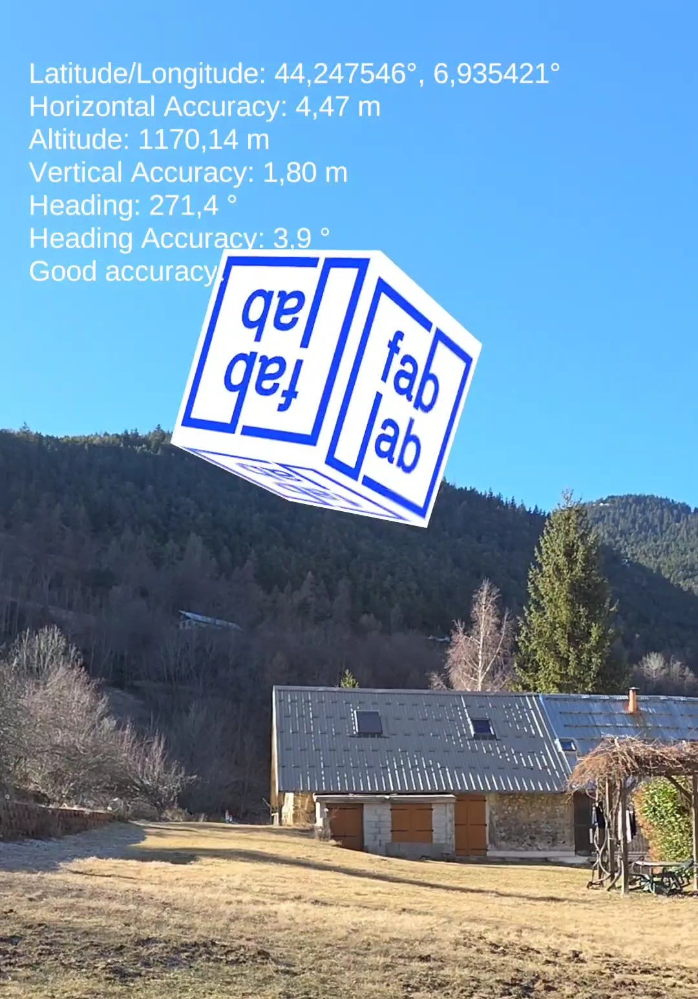

# Projet Unity ARCore Geospatial Test

Ce projet est une application de test développée avec Unity pour explorer les fonctionnalités de ARCore Geospatial API. Il permet de placer des objets 3D à des coordonnées GPS précises dans le monde réel en utilisant la réalité augmentée.

## 🛠 Technologies Utilisées

* **Moteur de jeu** : Unity (Compatible Unity 6)
* **AR Foundation** : Version 6.3
* **ARCore Extensions** : Version 1.52
* **Plateforme cible** : Android (Appareils compatibles ARCore)

## 📂 Structure du Projet

Le projet Unity se trouve dans le dossier `ProjectExamples`.

### Scènes Principales

Plusieurs scènes sont disponibles pour tester différentes fonctionnalités de placement et de suivi :

* **`Scenes/TestGPS_1.unity`** : Scène de test pour confirmer le placement d'objets à une latitude/longitude spécifique.
* **`Scenes/TestGPS_2.unity`** : Scène supplémentaire pour les tests de localisation.
* **`Scenes/TestGPS_3.unity`** : Scène avancée (ou alternative) pour le placement géospatial.
* **`Scenes/Tap_To_Place.unity`** : Scène permettant probablement de placer des objets manuellement via une interaction tactile (raycasting).
* **`Samples/ARCore Extensions/.../GeospatialArf6.unity`** : L'exemple officiel fourni par Google pour AR Foundation 6.

## 🚀 Installation et Configuration

1. **Ouvrir le projet** :
    * Lancez Unity Hub.
    * Ouvrez le dossier root du projet situé dans `ProjectExamples`.

2. **Configuration de l'API Key** :
    * Pour que les fonctionnalités Geospatial fonctionnent, vous devez avoir une clé API Google Cloud valide avec **ARCore API** et **Geospatial API** activées.
    * Dans Unity, allez dans `Edit > Project Settings > XR Plug-in Management > ARCore Extensions`.
    * Assurez-vous que votre clé API est renseignée dans le champ correspondant pour Android.

3. **Build sur Android** :
    * Connectez votre appareil Android en mode développeur.
    * Allez dans `File > Build Settings`.
    * Sélectionnez la scène que vous souhaitez tester (ajoutez-la à la liste si nécessaire).
    * Cliquez sur **Build And Run**.

## 📱 Utilisation

* Au lancement de l'application, acceptez les permissions pour la **Caméra** et la **Localisation** (précise).
* Le système va tenter de se localiser (VPS - Visual Positioning System). Il est recommandé d'être à l'extérieur dans une zone couverte par Google Street View pour une précision optimale.
* Une fois localisé, les objets définis dans la scène devraient apparaître à leurs coordonnées géographiques respectives.

## ⚠️ Notes Importantes

* Assurez-vous que votre appareil supporte **ARCore Geospatial API**.
* Une connexion Internet est requise pour télécharger les données de localisation VPS.

